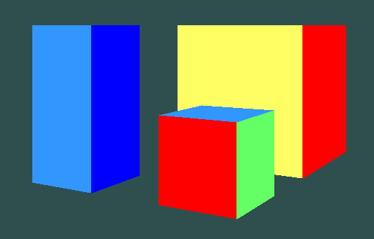

# Virtual Camera
## Project for Computer Graphics course at WUT

This project simulates a virtual camera, allowing users to navigate through a 3D environment using keyboard controls. Ideal for educational purposes and understanding the basics of computer graphics rendering. Implemented in python using numpy and pygame. Uses BSP Tree algorithm for hidden surface elimination.

### Controls
To interact with the virtual camera, use the following keyboard controls:

- **Movement**
  - `W`/`S` - Move camera up/down
  - `A`/`D` - Move camera left/right
  - `ARROW UP`/`ARROW DOWN` - Move camera forward/backward

- **Rotations (with `SHIFT`)**
  - `Q`/`E` - Rotate camera left/right
  - `W`/`S` - Rotate camera up/down
  - `A`/`D` - Roll camera left/right
- **Zoom**
  - `Z`/`X` - Zoom in/out
  

### Installation
To set up the Virtual Camera project, follow these steps:

1. Clone the repository to your local machine.
2. Ensure you have Python, Numpy and Pygame installed. You can use virtual enviroment.
3. Navigate to the project directory and run `python main.py`.

